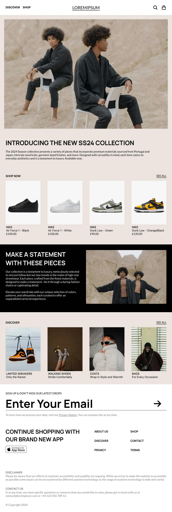
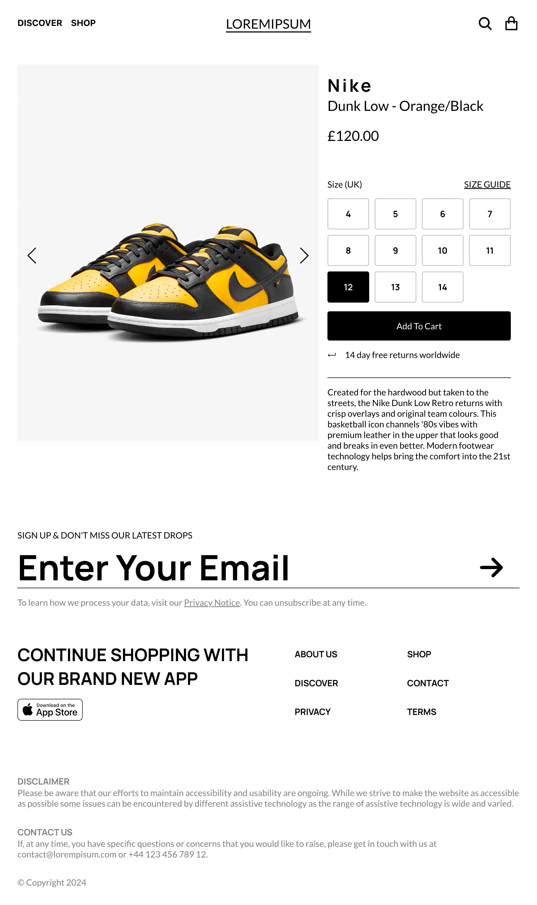
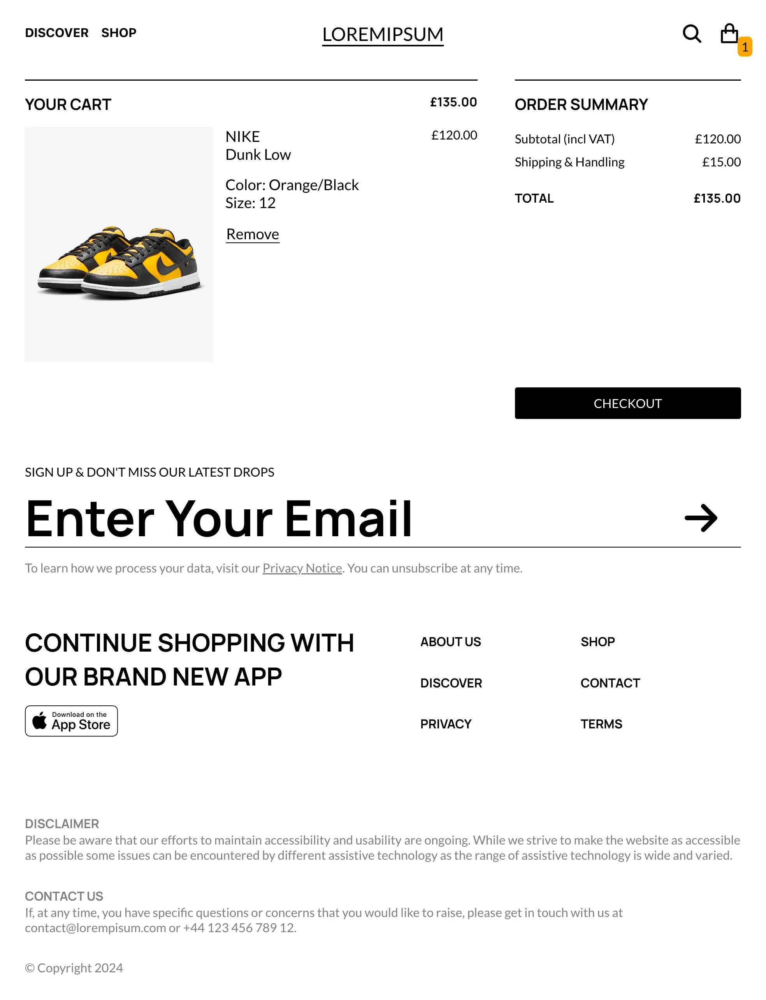
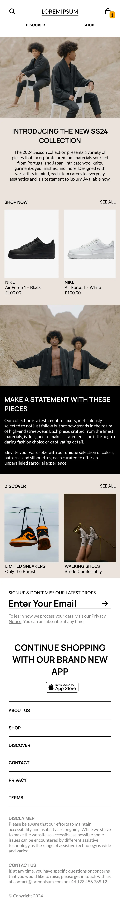
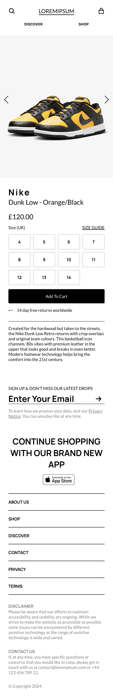
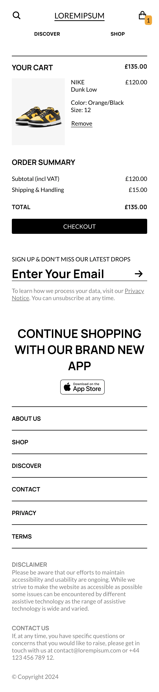

# Shopping Cart

## Features

- Search: Find the product you're looking for using our searchbar.
- Add to Cart: Conveniently add items to your shopping cart for a hassle-free checkout process.
- Responsive Design: Enjoy a seamless shopping experience across devices, including desktops, tablets, and smartphones.
- Product Details: View detailed information, including images, descriptions, sizes, and prices, for each product.

## Project Objectives

1. Implement a shopping page which lets users add & remove items from the cart.
1. Utilise routing to navigate between different webpages.

## Desktop Version Outcome

## Mobile Version Outcome

## Future Improvements

1. Add a product filter (along with different categories).
2. Add an account section.
3. Build out individual Blog pages.

## Credits

### Favicon:

1. <a href="https://www.flaticon.com/free-icons/clothes" title="clothes icons">Clothes icons created by msidiqf - Flaticon</a>

### Homepage Images:

1. Photo by Yury Oliveira: https://www.pexels.com/photo/young-man-wearing-a-furry-jacket-and-sunglasses-17045101/
2. Photo by Dario Rawert: https://www.pexels.com/photo/man-in-a-brown-coat-and-a-beanie-standing-against-the-wall-18907470/
3. Photo by Yalamber Limbu on Unsplash: https://unsplash.com/photos/black-and-orange-nike-sneakers-DS2ZIDNxWgk?utm_content=creditCopyText&utm_medium=referral&utm_source=unsplash
4. Photo by Anna Keibalo on Unsplash: https://unsplash.com/photos/a-woman-laying-on-a-couch-holding-a-lamp-CcVV-76L-aU?utm_content=creditCopyText&utm_medium=referral&utm_source=unsplash
5. Photo by Mike Von on Unsplash: https://unsplash.com/photos/woman-in-white-shirt-and-black-shorts-standing-beside-white-wall-NnLj_jd6p7k?utm_content=creditCopyText&utm_medium=referral&utm_source=unsplash
6. Photo by cottonbro studio: https://www.pexels.com/photo/men-in-black-kimono-holding-on-a-rock-surface-5807456/
7. Photo by cottonbro studio: https://www.pexels.com/photo/men-in-black-kimono-holding-on-a-rock-surface-5807459/

### Discover Images:

1. Photo by Opollo Photography on Unsplash: https://unsplash.com/photos/a-group-of-people-playing-a-game-of-tennis-bD97Uk9Ticw?utm_content=creditCopyText&utm_medium=referral&utm_source=unsplash
2. Photo by Hans Isaacson on Unsplash: https://unsplash.com/photos/white-and-black-plastic-cup-on-white-plastic-container-xn_q-ORMbHM?utm_content=creditCopyText&utm_medium=referral&utm_source=unsplash
3. https://unsplash.com/photos/red-coupe-infront-of-cartier-shop-mKsFAzUhvwQ?utm_content=creditCopyText&utm_medium=referral&utm_source=unsplash

### Shop Images:

The Nike images used on this website are owned by Nike, Inc. All rights to these images belong to Nike, Inc. and are used here solely for the purpose of showcasing hypothetical products available for sale. I do not claim ownership of these images, and they are used under the principles of fair use. Nike, Inc. is not affiliated with this website or products unless otherwise stated. If you have any concerns regarding the use of Nike images on this website, please get in touch.

The design elements, including layout, color scheme, and typography, featured on this website are for illustrative purposes only.
